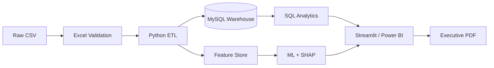

# Hospital Operations Intelligence Platform

> End-to-end healthcare analytics for patient flow, readmissions, bed demand, claims performance, and executive decision support.

**AI-Powered Healthcare Analytics and Decision Support System**

[](https://www.python.org/)
[](https://www.mysql.com/)
[](https://powerbi.microsoft.com/)
[](https://streamlit.io/)
[](#quality-and-governance)
[](#quality-and-governance)

## Overview

This project transforms disconnected admissions and claims data into a governed hospital intelligence platform covering validation, ETL, MySQL modeling, advanced SQL, machine learning, SHAP explainability, executive reporting, and a ten-page Streamlit application.

### At a Glance

| Admissions | Patients | Claims | SQL analyses | Notebooks | Quality checks |
|---:|---:|---:|---:|---:|---:|
| **120,000** | **64,873** | **70,000** | **60** | **8** | **28 contracts + 8 tests** |

## Business Problem

Hospital leaders need reliable answers across fragmented operational systems:

- Which wards have the highest readmission and LOS burden?
- How much billed value is collected, and where is revenue leaking?
- What occupied-bed demand should operations prepare for?
- Which results are observed, derived, simulated, or assumption-based?

## Architecture



### Data Reliability

Every analytical field is classified so decision-makers can distinguish evidence from demonstration data.

| Classification | Intended use |
|---|---|
| Observed | Descriptive analysis and executive KPIs |
| Derived | Reproducible segmentation and feature engineering |
| Simulated | Workflow demonstration only |
| Surrogate | Scenario analysis where source keys are unavailable |
| Assumption | Sensitivity analysis pending operational configuration |

## What the Platform Delivers

| Capability | Decision value |
|---|---|
| Executive Dashboard | Admissions, readmission, LOS, collections, capacity, and management priorities |
| Patient Analytics | Longitudinal encounter search, labs, medicines, severity, and risk segments |
| Ward and Bed Intelligence | Observed ward performance and 7/30/90-day occupied-bed forecasts |
| Claims Analytics | Billed versus paid value, payer collection, status, and leakage |
| Predictive Analytics | Patient-grouped readmission modeling and chronological bed forecasting |
| Explainable AI | SHAP global drivers, patient-level factors, and model-artifact lineage |
| SQL Warehouse | 12 normalized tables, views, procedures, triggers, indexes, CTEs, and windows |
| Executive Reporting | Four-page PDF with trends, thresholds, owners, and timeframes |

## Verified Business Insights

| Finding | Recommended action |
|---|---|
| ICU readmission is **23.8%** versus **11.8%** hospital-wide. | Review ICU discharge planning and follow-up. |
| High-complexity encounters record **21.3%** readmission. | Use the cohort for targeted screening. |
| Collections are **64.5%** of billed value despite **91.4%** claim approval. | Separate approval and collection controls. |
| ICU average LOS is **12.0 days** versus **4.5 days** in General wards. | Review transfer and discharge constraints. |

See the [executive decision pack](reports/executive_report.pdf) and [action plan](reports/executive_action_plan.csv).

## MySQL Analytics Warehouse

The warehouse contains **12 normalized tables** loaded in foreign-key order:

```text
patients        doctors         departments
admissions      diagnoses       procedures
medicines       labs            insurance
billing         claims          appointments
```

SQL implementation includes:

- Primary and foreign keys with validation constraints
- Analytical indexes for patient, date, department, and claim access
- Reusable KPI views and monthly reporting procedures
- Billing controls implemented through triggers
- **60 analytical queries** using CTEs and window functions
- A deployment verifier that records table counts and database readiness

See [`sql/schema.sql`](sql/schema.sql), [`sql/analytics.sql`](sql/analytics.sql), and [`sql/views.sql`](sql/views.sql).

## Dashboard Preview


<table>
  <tr>
    <td width="50%"><strong>Patient Analytics</strong><br></td>
    <td width="50%"><strong>Bed Occupancy</strong><br></td>
  </tr>
</table>

<details>
<summary><strong>View more application screens</strong></summary>
<br>

| Revenue Analytics | AI Prediction Center |
|---|---|
|  |  |

| Explainable AI | Reports and Assistant |
|---|---|
|  |  |

</details>

### Streamlit Application

The ten-page application supports:

| Area | Workflow |
|---|---|
| Executive | KPI monitoring, trends, thresholds, and accountable actions |
| Patients | Encounter search, timeline, labs, medicines, and risk profile |
| Doctors and departments | Workload, utilization, LOS, outcomes, and ranking |
| Beds and finance | Occupancy forecasts, claims, collections, and leakage |
| AI predictions | Readmission, occupied-bed, waiting-time, and revenue scenarios |
| Explainability | Global SHAP importance and patient-level risk factors |
| Reports | Executive PDF, governed downloads, and analytics assistant |

## Model Evaluation

| Tier | Task | Selected model | Held-out result |
|---|---|---|---|
| Core | 30-day readmission | Logistic Regression | ROC-AUC `0.736`, recall `0.673` |
| Core | Occupied-bed forecast | XGBoost | MAE `6.38 beds`, R2 `0.689` |
| Sandbox | Waiting-time workflow | Random Forest | RMSE `0.074 minutes` |
| Sandbox | Revenue scenario | CatBoost | RMSE `$2,890.79`, R2 `0.144` |

Core models use observed targets. Waiting time is simulated; admission-level revenue uses a surrogate claim link. Sandbox results demonstrate engineering workflow, not validated business performance.

## Technology Stack

| Data and SQL | ML and explainability | Delivery and quality |
|---|---|---|
| Excel, Pandas, NumPy, MySQL, SQLAlchemy | Scikit-learn, XGBoost, LightGBM, CatBoost, SHAP | Plotly, Streamlit, Power BI assets, Pytest |

## Quick Start

Run the production pipeline before launching the dashboard:

```powershell
cd "C:\Users\HP\Desktop\Hospital OP Inteligent sys"
python -m venv .venv
.venv\Scripts\Activate.ps1
python -m pip install -r requirements.txt
.\run_pipeline.ps1 -LaunchDashboard
```

Open `http://localhost:8501`.

### Execution Order

```text
Raw CSV validation
-> Cleaning and feature engineering
-> Model training and registration
-> SHAP explanation generation
-> Executive report generation
-> Contract validation
-> Streamlit application
```

For MySQL deployment, notebook order, testing, Power BI, and troubleshooting, follow the **[complete execution runbook](docs/RUNBOOK.md)**.

## Repository Structure

```text
config/       Central assumptions and thresholds
datasets/     Raw, interim, and processed data layers
docs/         Architecture, governance, recruiter guide, runbook
models/       Registered pipelines and model manifest
notebooks/    Cleaning through SHAP experimentation
powerbi/      DAX measures, theme, and implementation guide
reports/      Metrics, forecasts, screenshots, action plan, PDFs
sql/          Schema, views, procedures, and 60 analyses
src/          Production ETL, ML, reports, and validation
streamlit/    Interactive hospital operations application
tests/        Data, model, assistant, and UI tests
```

## Quality and Governance

- Patient-grouped splits record **zero train/test patient overlap**
- Model and dataset SHA256 hashes are stored in [`models/manifest.json`](models/manifest.json)
- SHAP reports are tied to exact registered model hashes
- Primary keys, foreign keys, dates, provenance, and actions are validated
- Observed, derived, simulated, surrogate, and assumed fields are explicitly labelled

```powershell
python src\validate_project.py
python -m pytest -q
```

## Limitations

- Portfolio analytics system, not a medical device
- Doctor, department, demographic, medicine, and appointment dimensions are derived
- Waiting time is simulated because queue timestamps were not supplied
- Admission-level revenue is surrogate-linked because source files share no encounter key
- Occupancy percentages use a configurable 500-bed assumption
- Power BI assets are included; a distributable `.pbix` is not included

## Documentation

[Execution Runbook](docs/RUNBOOK.md) | [Architecture](docs/ARCHITECTURE.md) | [Data Governance](docs/DATA_GOVERNANCE.md) | [Recruiter Guide](docs/RECRUITER_GUIDE.md) | [Power BI Guide](powerbi/README.md)

## Author

**Suhani Chauhan**  
B.Tech CSE (Data Science) | Aspiring Data Analyst / ML Engineer

[GitHub](https://github.com/suhani-chauhan56) | [LinkedIn](https://www.linkedin.com/in/suhani-chauhan-39055832a)
